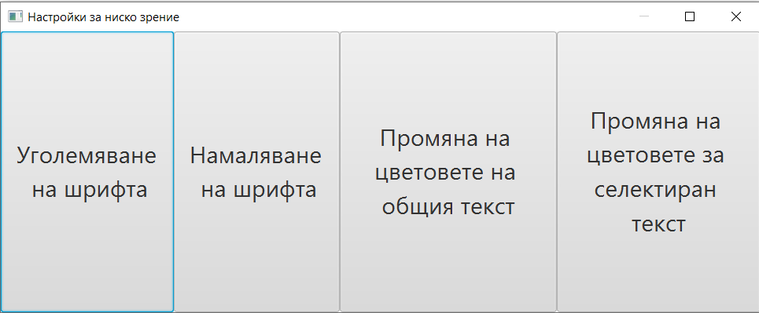

# Bookreader

This is a desktop application that can help visually impaired people to read documents or books.

# How to run

The application can be started through Gradle, by running
```
gradle bootrun
```
in the directory.

# Features

- Extracting English and Bulgarian text from images and documents
- Supports .txt, .pdf, .png, .jpg and other commonly used formats for texts and images
- Reading text through text-to-speech. Reading individual words or sentences.
- Low vision settings, such as enlargening the text on the screen or changing the font and background colours
- Taking a picture with the camera and reading it as text.

# How to use

## Menu explained

To open a file, click the first menu (Файл/File) in the bar at the top, followed by the first option (Отвори/Open).
From there, select a file and it will be read. To close the file, click the second option from the same menu
(Затвори/Close).

To take a picture with the camera instead, click on the second menu (Камера/Camera), then click the only option
(Снимане/Take Picture).

For people with low vision, they can change the way the font looks in the application from the third menu
(Настройки за ниско зрение/Low vision settings), then clicking the only option. This will create a pop-up screen with
4 options:



From left to right they are: Increase font size, Decrease font size, Changes colour scheme for overall text, Change colour scheme for selected text.

The last menu is for testing purposes and should not be used or be visible during normal use.

## Navigating the text

When a file is opened, the application will automatically start reading the text from the beginning
until the end, word by word. Clicking on any word will move the marker to it and say it.

Using the 
arrows you can navigate to the next or previous word. Using the 'A' and 'D' keys moves the marker
to the previous or next sentence, respectfully. Using the up and down arrows moves the cursor to the
closest word that's below or above the current one, vertically.